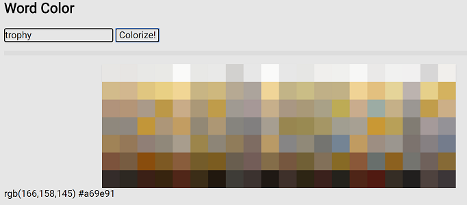
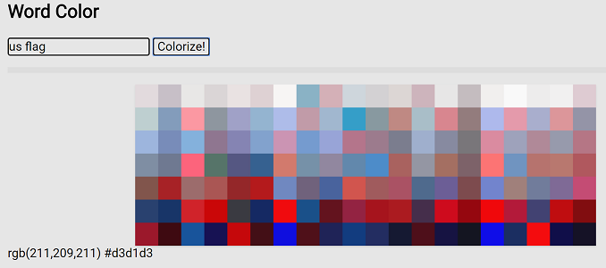

# word-color

[](https://greenkeeper.io/)

:art: :zap: Creates word-color associations.

### TODO:
1. make all client-side, no server
    - can't use cheerio front-end?, need to replace somehow...
2. implement caching via online JSON storage solution
3. use https://www.npmjs.com/package/color-sort to display results


> Examples:
<br></br>
</img>
</img>
</img>
</img>

## Try it out!
[Live Demo](https://wordcolor.netlify.com/)

Or locally:
```
$ git clone https://github.com/cktang88/word-color
$ cd word-color
$ npm i
$ npm start
```
Go to http://localhost:1234 in your browser.

:fire: :fire: :fire:

## How it works

1. Scrapes top images of the word from search engines.
2. For each image, use [MMCQ (modified median cut quantization)](https://en.wikipedia.org/wiki/Median_cut) to extract a palette of dominant colors.
3. Average palettes of all images to get final palette.